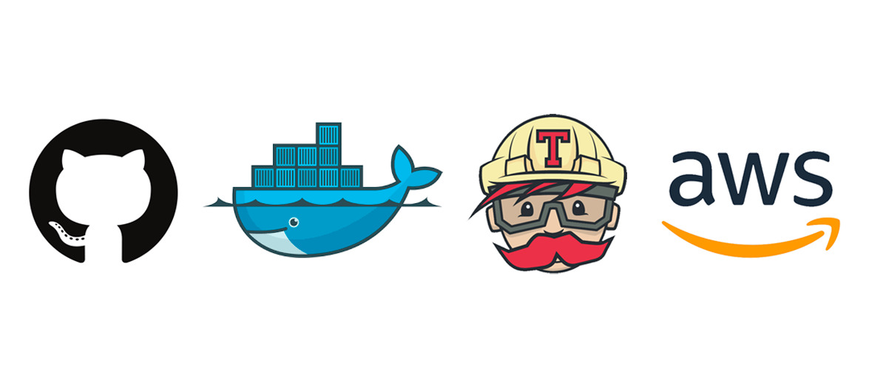
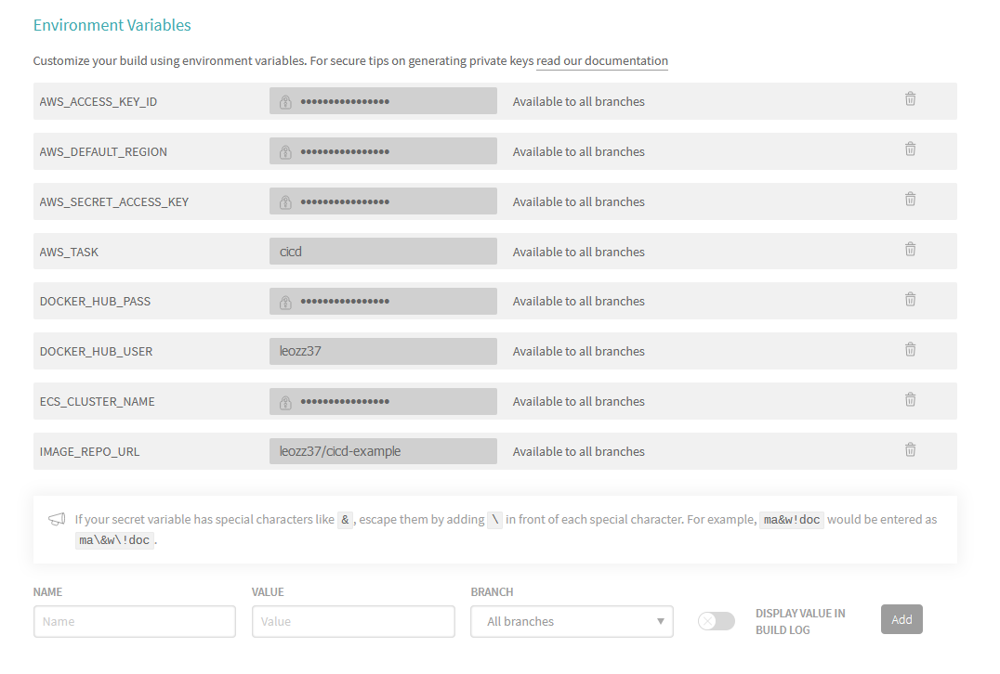

# CI/CD Project Starter [](https://travis-ci.com/leozz37/cicd-project-starter)



# Getting Started

This template is aimed to help you set up a CI/CD development environment on the cloud!

Check my [article](https://medium.com/@leonardoaugusto287/creating-a-ci-cd-environment-and-deploying-containers-in-the-cloud-e97811a4888a) about CI/CD!

We will be using the following tools for, but feel free to adapt to your project needs:

-   [Github](https://guides.github.com/activities/hello-world/)
-   [Docker](https://www.docker.com/)
-   [Travis](https://travis-ci.com/)
-   [Amazon Web Services (AWS)](https://aws.amazon.com/pt/)


For the sake of this tutorial, Python is the language of choice to make things easier. But since we're using Docker, you can build anything with it!

## Source Tree

```
image
|__cover.jpeg
```

- [image](./image) directory has no practical use, only for reference and aesthetics.

 ```
scripts
|__create-ecs.sh
|__deploy.sh
 ```

- [create-ecs.sh](./scripts/create-ecs.sh) it's just a reference on how my ECS Cluster is configured. You should not run this script, adapt for your needs.
- [deploy.sh](./scripts/deploy.sh) is the script used by Travis to deploy our application on AWS.

```
src
|__main.py
```
- [src](./src) is where your src code should be.

```
|__.gitignore
|__.travis.yml
|__docker-compose.yml
|__Dockerfile
|__ecs-params.yml
|__LICENSE
|__README.md
|__requirements.txt
```

- [.gitignore](./.gitignore) stores the files that git will ignore if there are any changes.
- [.travis.yml](./.travis.yml) is the CI script for Travis.
- [docker-compose.yml](./docker-compose.yml) holds the settings for building and running the container.
- [Dockerfile](./Dockerfile) has the environment configuration to build your application.
- [ecs-params.yml](./ecs-params.yml) has the service settings for ECS.
- [LICENSE](./LICENSE) is the repository License.
- [README.md](./README.md) is the file you're reading right now.
- [requirements.txt](./requirements.txt) dependencies for our Python application.

## Containerization

[Dockerfile](Dockerfile) and [docker-compose.yml](Docker-compose.yml) are responsible for the build. You need [Docker](https://docs.docker.com/get-docker/) and [Docker Compose](https://docs.docker.com/compose/install/) installed.

To build the Dockerfile, use the following command:

```
$ docker build -t cool-image-name . 
```

Running:

```
$ docker run -p 80:8000 cool-image-name
```

You can use [Docker Hub](https://hub.docker.com/) as your image repository, just change on the image on docker-compose file for your user and image name, following by the tag like this: 

`leozz37/cicd-example:latest`

To push an image to Docker Hub, follow these commands:

```
$ docker build -t leozz37/cicd-example .

$ docker tag leozz37/cicd-example:latest leozz37/cicd-example:latest

$ docker push leozz37/cicd-example:latest
```

For docker-compose:

```
$ docker-compose up
```

## Continuous Integration and Continuous Deployment

We're using Travis CI building, running tests, and deploy. Check their [documentation](https://docs.travis-ci.com/user/tutorial) for more information. Access [Travis website](https://travis-ci.io), log in with your Github account and enable your repository.

On our [travis.yml](.travis.yml), we're only using the _deploy_ and _before\_install_ steps, but feel free to use all of them! They go in the following order:

-   install:
-   before_install:
-   script:
-   after_success:
-   after_failure:
-   after_script:
-   before_deploy:
-   deploy:
-   after_deploy:

I recommend you use them to install dependencies, run tests, generate alerts, etc.

Travis lets you set up environment variables on the settings tab of the project. For deploy, should look like this:



## Deployment

Amazon Web Services (AWS) is our tool of choice. They have so many tools and services to offer, we don't have a general sample to use. But since we're using Docker to deploy our system, we'll be using ECS to deploy ou application to the world.
I highly recommend that you [READ THE DOCS](https://docs.aws.amazon.com/ecs/index.html), since it can charge you for its use. But for a small application, AWS [free tier](https://aws.amazon.com/free/) is enough.

For the ECS setup, [create-ecs.sh](./scripts/create-ecs.sh) offers an example for the commands used to create the sample for this project. It has some env variables, that you can swap for your credentials and configs.
It shows two ways of hosting the image, through DockerHub and ECR, pick what fits you better.

There's basically three ways of setting [deploy.sh](./scripts/deploy.sh) up. The first is through Docker Hub, so you can remove ECR's code. The second is through ECR, then you can remove Docker Hub code. The third (and probably better one) is setting up [AWS Blue-Green Deployment](https://aws.amazon.com/quickstart/architecture/blue-green-deployment/) and use [ecs-deploy](https://github.com/silinternational/ecs-deploy) lib for deploying.

## Alternative Tools

We'll be using (kinda) free tools for this example, but feel free to use and explore other tools! Here are some recommendations:

Instead of Github, you can use [Gitlab](https://about.gitlab.com/) or [Bitbucket](https://bitbucket.org/).

For Docker, you can't go much farther than [Kubernetes](https://kubernetes.io).

Travis has a lot of competitors, such as [appveyor](https://kubernetes.io), [Jenkins](https://www.jenkins.io/), [CodePipeline](https://aws.amazon.com/codepipeline/), [CircleCI](https://circleci.com/), [Gitlab CI Tool](https://docs.gitlab.com/ee/ci/pipelines/) and many more...

For AWS it depends on your system. If you hosting a static web page, you can use [Github Pages](https://pages.github.com/), if it's a more complex system there's [Google Cloud](https://cloud.google.com/), [Azure](https://azure.microsoft.com/), [Heroku](https://www.heroku.com/) and many many more.

Check my [book and tools recommendations for software engineering](https://github.com/leozz37/books), for more CI/CD tools.

## Author

Feel free to send me an [email](mailto:leonardoaugusto287@gmail.com) or follow my [Github account](https://github.com/leozz37)!
